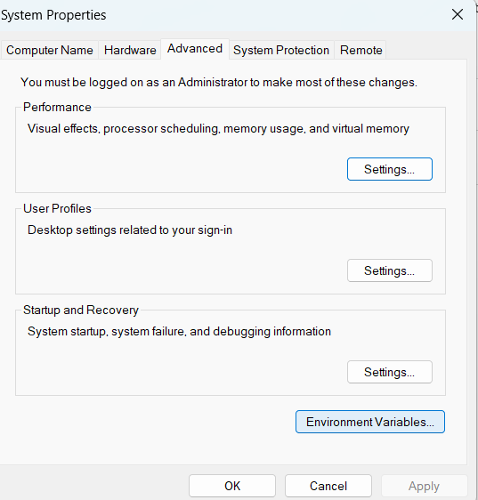
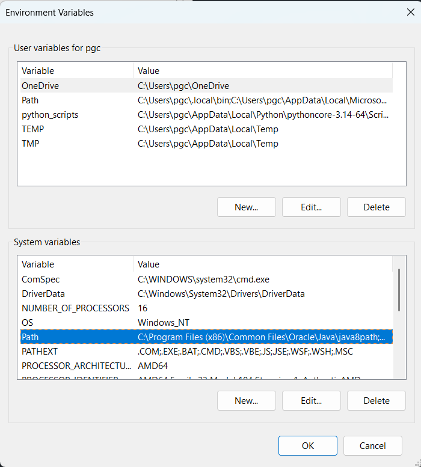
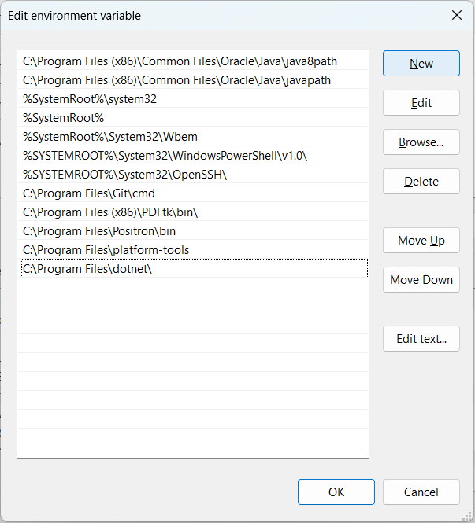
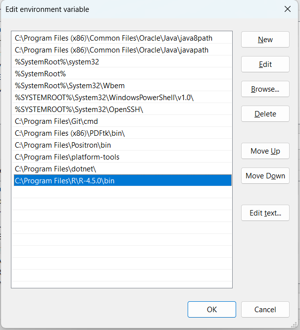

# proteOmni

**proteOmni** is a comprehensive, unified Shiny-based dashboard for visual quality control (QC), diagnostics, and differential abundance analysis of proteomics results from multiple search engines and acquisition strategies. It centralizes eight specialized modules covering DDA, DIA, and *de novo* sequencing workflows into a single interactive application.

## Benefits of using proteOmni

-   **Unified Interface**: One central hub for evaluating proteomics results across Data-Dependent Acquisition (DDA), Data-Independent Acquisition (DIA), and *de novo* sequencing — from FragPipe, DIA-NN, MaxQuant, Sage, EncyclopeDIA, Casanovo, and InstaNovo.
-   **Deep QC Insights**: Generate detailed metrics including protease fingerprints, sequence logos, mass accuracy (ppm), retention time prediction errors, charge state and peptide length distributions, missed cleavages, GRAVY index, and isoelectric point (pI) profiles.
-   **Interactive Visualization**: Explore 3D QuantUMS score distributions, interactive PCA plots, sample correlation matrices, cosine/Euclidean/Jaccard similarity heatmaps, and annotated MS/MS fragmentation spectra directly in the browser.
-   **Peptide-to-Protein Mapping**: Map identified peptides onto user-provided FASTA sequences with a colour-coded protein sequence viewer.
-   **Differential Abundance Analysis**: Full limma-based workflow with normalization, batch correction (ComBat/SVA), missing value imputation (missForest), MA plots, volcano plots, and statistical power mapping.
-   **Functional Enrichment**: Over-representation analysis (ORA) with gene-set annotation using clusterProfiler and enrichplot.
-   **Publication-Ready Output**: Download filtered result matrices and universally formatted plots (PNG/ZIP) ready for reporting and publication.
-   **Session Logging**: Automatic session and console logging with a one-click log download for reproducibility.

## Modules Included

1.  **PSManalyst** *(FragPipe / DDA)*: Visual QC for FragPipe DDA results. Tabs include a **PSM Viewer** (protease fingerprint, N/C-termini sequence logos, m/z over retention time, mass error distributions, charge states, peptide length, amino acid frequencies, missed cleavages, and sample-to-sample scatter plots), an **MS/MS Spectrum Viewer** (annotated b/y fragment ion spectra for any selected PSM), and a **Protein Viewer** (peptide coverage mapped onto FASTA sequences with sample comparison via cosine and Jaccard similarity).
2.  **QC4DIANN** *(DIA-NN / DIA)*: Diagnostics for DIA-NN `.parquet` reports. Includes **QC Filters & Distributions** (XIC reconstruction, ion density in m/z–RT space, RT prediction error, charge state and peptide length distributions, missed cleavages, FASTA coverage) and an **Interactive Viewer** (sample correlation, cosine/Euclidean/Jaccard similarity heatmaps, 3D QuantUMS score distribution, interactive PCA, and full sample correlation matrix).
3.  **PwrQuant** *(limma / stats)*: End-to-end differential abundance pipeline. Tabs cover **Metadata Mapping** (editable sample-condition-batch table), **Sparsity** (missing-value heatmap), **Pre-processing QC** (CV distributions, mean–variance relationship, normalization boxplots), **Differential Abundance** (MA/Bland-Altman plots, volcano plots, top DAPs, p-value histograms), **Correlation** (inter-contrast scatter), **Power Statistics** (statistical power and reliability map), and **Enrichment** (ORA dotplots via clusterProfiler).
4.  **Casanovo** *(de novo)*: Visualiser for Casanovo *de novo* sequencing output. Loads `.mztab` files from a user-specified directory and provides score/AA-score filtering, peptide length and score distributions, N/C-termini sequence logos, and amino acid frequency analysis.
5.  **InstaNovo** *(de novo)*: Visualiser for InstaNovo *de novo* sequencing results. Tabs include **Overview** (score distribution, peptide length, charge state, mass error in ppm, PSM retention vs. score threshold) and **Peptide Analysis** (median score by length, ppm error vs. score, GRAVY index, pI distribution, N/C-termini sequence logos).
6.  **EncyclopeDIA** *(EncyclopeDIA / DIA)*: Aggregates and explores EncyclopeDIA DIA results from a directory of `.txt` result files. Tabs cover **Overview** (protein and peptide identifications per file, score distribution, PEP, q-value, peptide yield vs. FDR curve) and **Peptide Properties** (charge state, modifications, peptide length, GRAVY index, pI, amino acid frequencies).
7.  **Sage** *(Sage / DDA)*: QC dashboard for Sage search engine results (`.tsv` or `.parquet`). Tabs include **Overview** (PSM counts, proteins and peptides by file, LDA discriminant score), **Peptide Properties** (charge state, length density, missed cleavages, GRAVY, pI), **Mass Errors** (RT vs. mass error, fragment error in ppm, RT vs. precursor error, precursor mass error density), and **Scoring & Validation** (peptide/protein q-value, peptide yield vs. FDR).
8.  **MaxQuant** *(MaxQuant / DDA)*: QC module for MaxQuant results. Provides an **annotated MS/MS fragmentation spectrum** viewer (b/y ions coloured by ion series) for any peptide in `msms.txt`, together with **evidence-level QC metrics** from `evidence.txt` (mass error distribution, charge states, modifications, missed cleavages, and more).

## Quick How to Use

1.  **Launch the Application**: Run the `Launch\\\_proteOmni` file for your operating system (`.bat` for Windows, `.command` for macOS). Alternatively, open R/RStudio and run `shiny::runApp("proteOmni")`.
2.  **Select a Module**: On the proteOmni home page, click the card for the tool you want to use.
3.  **Upload Data**: Use the sidebar to provide the required files for the chosen module:

| Module | Required files | Optional |
|------------------------|------------------------|------------------------|
| **PSManalyst** | `psm.tsv`, `combined\\\_protein.tsv` | FASTA file |
| **QC4DIANN** | `report.parquet` | FASTA file |
| **PwrQuant** | Protein abundance matrix (`.tsv` / `.csv`) | — |
| **Casanovo** | Path to directory containing `.mztab` files | — |
| **InstaNovo** | InstaNovo results `.csv` file | FASTA file |
| **EncyclopeDIA** | Path to directory containing EncyclopeDIA `.txt` result files | FASTA file |
| **Sage** | `results.sage.tsv` or `.parquet` | FASTA file |
| **MaxQuant** | `msms.txt`, `evidence.txt` | — |

4.  **Explore & Filter**: Navigate through the generated tabs to explore interactive graphs, spectra, sequence logos, and result tables. Adjust filters and parameters in the sidebar as needed.
5.  **Download**: Click the download buttons in the sidebar to export plots (PNG/ZIP) and filtered tables for offline use.

## Troubleshooting

<details>

<summary> <b> Rscript is not recognized (Windows) </b> </summary>

When trying to execute the application using the `proteOmni.bat` file for the first time on Windows, you might encounter the following error:

> `'rscript' is not recognized as an internal or external command, operable program or batch file.`

This happens because Windows doesn't know where the R executable (`Rscript.exe`) is located. To fix this, you must add the R `bin` folder to your system's Environment Variables path.

**How to add R to your PATH:** 

1. Open the Windows **Start Menu**, search for **"Environment Variables"**, and click on **"Edit the system environment variables"**.

<p align = "center">


</p>

2.  In the System Properties window, click the **"Environment Variables..."** button near the bottom.

    

3.  In the new window, find the **"Path"** variable under the *System variables* list (or *User variables*), select it, and click **"Edit..."**.

    {width="398"}

4.  Click **"New"** and paste the folder path to your R `bin` directory. This path usually looks like: `C:\\\\Program Files\\\\R\\\\R-4.x.x\\\\bin` *(Replace `4.x.x` with your specific R version)*.

    {width="329"}{width="329"}

5.  Click **"OK"** on all windows to save the changes.

6.  Open a new Command Prompt (or just double-click the `.bat` file again) to run proteOmni successfully.

</details>

<details>

<summary> <b>Error in loadNamespace (Windows / macOS) </b> </summary>

When launching proteOmni via the `.bat` or `.command` file, you may see an error like:

> `Error in loadNamespace(j <- i\\\[\\\[1L]], c(lib.loc, .libPaths()), versionCheck = vI\\\[\\\[j]]) :` `namespace 'promises' 1.3.3 is already loaded, but >= 1.5.0 is required`

This means one or more R packages in your library are outdated and conflict with the versions required by proteOmni's dependencies. To fix this, update the affected package(s) from within R or RStudio:

``` r
install.packages("promises")
```

If the error points to a different package, replace `"promises"` with the package name shown in the error message. After installation, re-launch proteOmni using the `.bat` or `.command` file. You can check the version of the installed package with:

``` r
packageVersion("promises")
```

</details>

## Citation

If you use proteOmni in your research, please cite the following:

-   Chaves AFA. PSManalyst: A Dashboard for Visual Quality Control of FragPipe Results. *J Proteome Res.* 2025 Sep 5;24(9):4344-4346. doi: [10.1021/acs.jproteome.5c00557](https://doi.org/10.1021/acs.jproteome.5c00557). Epub 2025 Aug 15. PMID: 40815682.
-   Moschem JDC, de Barros BCSC, Serrano SMT, Chaves AFA. Decoding the Impact of Isolation Window Selection and QuantUMS Filtering in DIA-NN for DIA Quantification of Peptides and Proteins. *J Proteome Res.* 2025 Aug 1;24(8):3860-3873. doi: [10.1021/acs.jproteome.5c00009](https://doi.org/10.1021/acs.jproteome.5c00009). Epub 2025 Jul 8. PMID: 40629671.